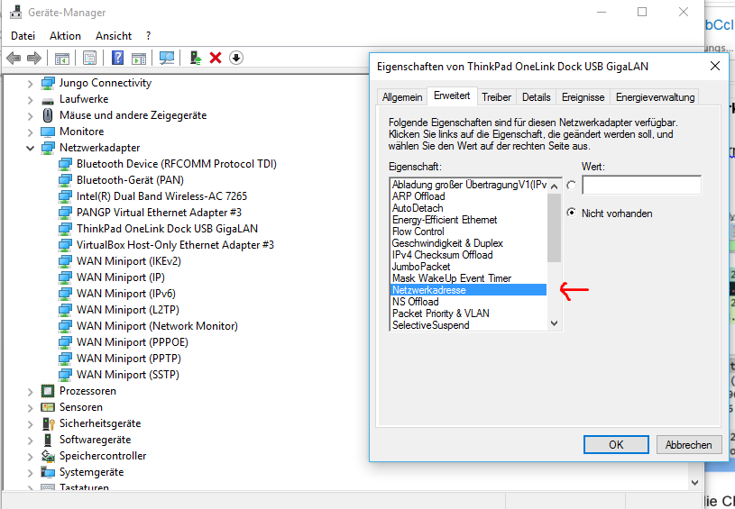

_Übungsaufgabe zur Veranstaltung [IT
Systeme](https://hsro-wif-it.github.io) im [Bachelorstudiengang
Wirtschaftsinformatik](https://www.th-rosenheim.de/technik/informatik-mathematik/wirtschaftsinformatik-bachelor/) an der [Hochschule Rosenheim](http://www.th-rosenheim.de)._

# 07 - Netzwerke Part I

Diese Übung behandelt das Thema _Netzwerke_. Zunächst mit dem Fokus auf die unteren beiden Layer des OSI Modells.

> Note: **Die Lösung befindet sich im Branch _Musterlösung_.**

## Aufgabe 1: Bandbreite, Nyquist, Shannon

Lösen Sie die folgenden Aufgaben:

### a)	
Ein rauschfreier Fernsehkanal habe eine Bandbreite von 7 MHz. Wie viele Bytes pro Sekunde kann man senden falls 4 Symbole / Signalschritte verwendet werden? Wie hoch ist die Baudrate? 

### b)	
Über einen rauschfreien Kanal der Bandbreite 4 kHz sollen Daten übertragen werden. Ist die mögliche Datenrate theoretisch nach oben begrenzt? Falls ja, begründen Sie ihre Antwort. Falls nein, erklären Sie wie man eine Datenrate von 8 kbits/s und 64 kbits/s erreichen könnte? 

### c)	
Wie hoch ist die Datenrate des Kanals aus Aufgabe a) maximal, falls es sich um einen verrauschten Kanal handelt und das Signal-to-Noise Ratio 30dB beträgt? 

**Lösung**

a)
Die maximale Datenrate D berechnet man nach dem Nyquist Theorem:  D= 2*B*log_2⁡ V .

Es ergibt sich: D=(2∙7MHz∙log_2⁡ (4)) [bits/s]=28 Mbit/s=3,5MB/s 

Da jedes Symbol 2 Bit an Information repräsentiert, ist die Baudrate halb so groß wie die Bitrate, also 14 MBaud.

b)
Prinzipiell könnte ein unverrauschter Kanal eine beliebige Menge an Informationen transportieren. 
Gemäß Nyquist gilt: D= 2*B*log_2⁡(V) [bits/s]

Demnach muss man für hohe Datenraten lediglich die Anzahl der Symbole, also V erhöhen. Dadurch kodiert man viel Information pro Symbol. 

Anhand der Nyquist-Formel ermittelt man: 

D= 2*B*log_2⁡(V) -> D/2B= log_2⁡(V) -> 2^(D/2B)=V

Durch Einsetzen der Werte D=8kbit/s und D=64kbit/s erhält man: 

	V=2^((8 [kbit]/s)/(2∙4kHz))=2
	
     bzw. 
	
	V=2^((64[kbit]/s)/(2∙4kHz))=256

Bei 2 bzw. 256 verschiedenen Symbolen könnte man also diese theoretischen Datenraten erreichen. In der Praxis kann man aber nicht beliebig viele Symbole einsetzen. Aufgrund von Rauschen würde sich ein Empfänger dann sehr schwer tun, die einzelnen Symbole auseinanderzuhalten.

c)
Das Shannon-Theorem gibt eine zusätzliche obere Grenze für die erreichbare Datenrate vor, falls ein Kanal verrauscht ist.  

Zunächst rechnet man Dezibel in ein absolutes Verhältnis d=S/N  um: 
30 = 10 log(d)  →  3 =  log(d)  →  d = 1000

Shannon: D= B*log_2⁡(1+S/N)[bits] = 7MHz∙log_2⁡(1+1000) [bits/s]=70 Mbit/s

Hinweis: Ohne Rauschen ließe sich die Datenrate beliebig steigern, wenn man sehr viele Symbole definieren würde. Nach Shannon ist die Anzahl der Symbole bei gegebenem S/N Ratio aber in der Theorie begrenzt. Der Noise muss berücksichtigt werden, damit die Symbole noch unterscheidbar bleiben 


## Aufgabe 2: Übertragungsmedien

Diskutieren Sie, ob es sich in den folgenden drei Fällen um ein Full-Duplex, Half-Duplex oder Simplex-System handelt!
•	Ölpipeline
•	Funkgerät / Walkie Talkie
•	Bach bzw. Fluss

**Lösung**
- **Ölpipeline**: Half-Duplex unter der Annahme, dass Öl in beide Richtungen fließen kann. Man könnte auch argumentieren, dass es Simplex ist, falls Öl nur in einer Richtung fließen kann. 
- **Funkgerät**: Halb-Duplex. Meist muss man einen Knopf drücken während man spricht. Während dieser Zeit wird nichts empfangen. 
- **Fluss**: offensichtlich Simplex. 


## Aufgabe 3: Rahmenbildung

### a)	

Ein Link-Layer Protokoll verwendet folgende Zeichenkodierung:

```
A       01000111
B       11100011
FLAG	01111110
ESC  	11100000
```

Es soll der 4-Character-Frame „A B ESC FLAG“ übertragen werden. Welche Bitsequenz wird auf der Physical Layer jeweils in folgenden Fällen übertragen?

- **Byte Count**: Am Anfang des Frames wird die Länge des Frames binär-kodiert übertragen.
- **Byte Stuffing**: Anfang und Ende des Frames wird durch FLAG Zeichen markiert.
- **Bit Stuffing**: Anfang und Endes des Frames wird durch FLAG Zeichen markiert. Die Link Layer verwendet Bit Stuffing, falls sie das Bit 1 fünfmal hintereinander senden muss.

### b)	

Sie erhalten einen Frame. Auf Senderseite wurde das Bit Stuffing-Verfahren eingesetzt wie in der Vorlesung beschrieben. Kann der erhaltene Frame eine Folge von 6 1er-Bits enthalten?

**Lösung**

a)	Falls die Link Layer „A B ESC FLAG“ (entspricht 01000111 11100011 11100000 01111110) übertragen möchte, so ergeben sich auf der Physical Layer je nach Verfahren unterschiedliche Bitsequenzen: 

- **Byte Count**: Am Anfang wird ein Byte-Wert hinzugefügt, der die Gesamtlänge des Frames angibt. Im konkreten Fall ist das 5 (00000101), wenn man das Längenfeld mitrechnet. Es ergibt sich: 00000101 01000111 11100011 11100000 01111110.
- **Byte Stuffing**: Anfang und Ende des Frames wird durch FLAG Zeichen markiert. Man beachte, dass ESC-Zeichen ggfs. hinzugefügt werden müssen. Es ergibt sich 
01111110 01000111 11100011 11100000 11100000 11100000 01111110 01111110
- **Bit Stuffing**: Bei Bit Stuffing darf nur am Frameanfang und Frameende 6mal hintereinander die 1 gesendet werden. 
01111110 01000111 110100011 111000000 011111010 01111110

b)	Ja, der Frame muss sogar eine Folge von 6 1er Bits enthalten. 6 aufeinanderfolgende 1er Bits weisen nämlich den Empfänger daraufhin, dass es sich um den Beginn bzw. das Ende eines Frames handelt. 


## Aufgabe 4: MAC Adressen

### a)	
Wie lautet die MAC Adresse Ihres PCs? Wie können Sie diese über die Shell ermitteln? **Ggfs. Internet-Recherche!**

### b)	
Ermitteln Sie direkt über die MAC Adresse den Hersteller Ihrer Netzwerkkarte! https://macvendors.com/

### c)	
Versuchen Sie die MAC Adresse Ihres PCs zu ändern! Ggfs. Internet-Recherche!
Hinweis: Verwenden Sie falls möglich einen Ethernet-Netzwerkadapter, keinen WLAN-Netzwerkadapter! 
    
    >Note: Vergessen Sie nicht, die Original-MAC Adresse anschließend wiederherzustellen!

**Lösung**
a)	Die MAC Adresse lautet z.B.: 00:50:B6:7C:53:53. 
Es gibt unter Windows mehrere Möglichkeiten die MAC Adresse zu bestimmen, z.B.: 
1. `ipconfig /all` auf der Kommandozeile oder 
2. über den Gerätemanager und die Treibereinstellungen, siehe Screenshot unten. 
3. unter Linux funktioniert z.B. `ip addr` oder `ifconfig`

b)	Das Präfix einer MAC Adresse (die ersten x Bits) gibt Aufschluss über den Hersteller der Netzwerkkarte. Jeder Hersteller bekommt einen bestimmten Präfix zugewiesen. 
Im konkreten Fall ist das: GOOD WAY IND. CO., LTD.

c)	Unter Linux geht das Ändern recht einfach mit folgenden Befehlen:

```
ip link set dev <interface-name> down
ip link set dev <interface-name> address <mac-address>
ip link set dev <interface-name> ip
```
Nach einem Neustart sollte die ursprüngliche MAC Adresse wieder vorhanden sein. 

Unter Windows ist es nicht immer möglich die MAC Adresse zu ändern. Vor allem bei WLAN Netzwerkkarten gibt es Schwierigkeiten. Der Standardweg zum Ändern wäre über die Systemsteuerung, siehe Screenshot


